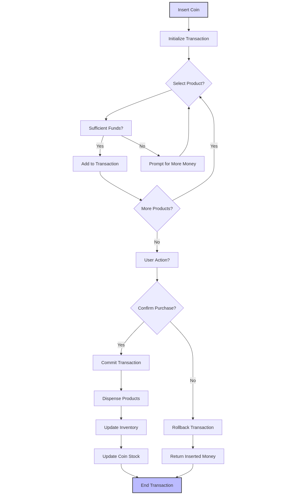
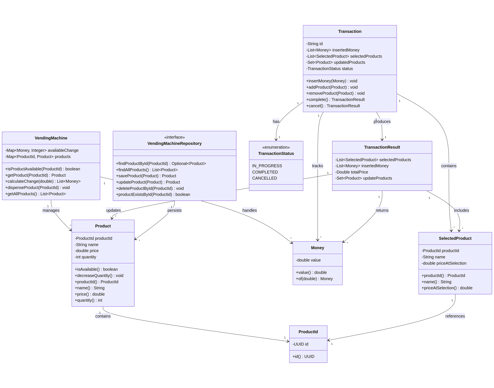

# Vending Machine Backend


A Spring Boot backend application implementing a **vending machine system** based on **Domain-Driven Design (DDD)**. The system manages transaction lifecycles, inventory control, and monetary operations with a clear architectural separation.

## Table of Contents

* [Project Overview](#project-overview)
* [Intuition](#intuition)
* [Architecture](#architecture)
* [Project Structure](#project-structure)
* [Testing and Code Quality](#testing-and-code-quality)
* [Documentation](#documentation)
* [Domain Model](#domain-model)
* [Getting Started](#getting-started)
* [API Documentation](#api-documentation)

## Project Overview

This backend system for a **Vending Machine** is developed with **Spring Boot** and adheres to **DDD** principles for high cohesion and low coupling. It handles complex business workflows such as inventory checks, money insertion, transaction processing, and change return.

## Intuition

Here is the thought process that guided the design of this project.

I began by identifying key design principles, starting with how a typical vending machine works based on known behavior and the provided scenarios. Normally, the flow is simple:

1. Insert money
2. Buy one item
3. Receive your change
4. Repeat the process for another item

However, the second scenario you described challenged this model. In it, the user inserts money, selects **two products**, and only **then** completes the transaction—at which point the products are dispensed. This revealed a need for a **trigger-based transactional model** rather than a linear one.

That led me to an analogy with **database transactions**. Just like in databases, where we can start a transaction (implicitly or explicitly), perform a series of operations, and then either **commit** or **rollback**, the same concept can apply to our vending machine.

* **Start Transaction:** Implicit, triggered by inserting money after the previous transaction is complete
* **Perform Operations:** Select products based on available funds
* **End Transaction:** Explicitly triggered by either completing or canceling the purchase

In this model, the **transaction** is conceptually separate from the **vending machine** itself. The vending machine maintains its state (inventory and coin stock), while the transaction tracks temporary state changes—inserted money and selected products—without immediately altering the machine.

A key design decision was to **tie product selection to available funds**. That is, a user can only select a product if they have already inserted enough money to cover it. This ensures that the transaction remains in a valid state at all times—moving only between valid configurations. This simplifies validation and avoids handling inconsistent states later in the process.

The **second trigger**—the action that completes or cancels the transaction—is handled explicitly. For example, a "confirm purchase" or "cancel" button in a real machine. If the transaction is canceled, no changes are applied to the vending machine's state: the inserted money is returned, and the selected products are discarded. If it's completed, the products are dispensed and the machine's state is updated accordingly.

This separation of concerns works well because a vending machine typically serves **one customer at a time**. So, we can treat the vending machine and the active transaction as **conceptual singletons**—even if not implemented as literal singleton instances.



To calculate the change to be returned after a purchase, I used a **greedy algorithm**. This decision is both practical and optimal in most real-world scenarios. The goal is to return change using the **fewest number of coins possible**, prioritizing **larger denominations first**. This has two key advantages:

* It is faster and more convenient for the user to receive fewer coins.
* It helps the machine preserve smaller denominations, which are often needed to provide accurate change in future transactions.


## Architecture

This project follows a **four-layer DDD architecture**:

### Domain Layer

* Core business logic
* Entities, value objects, and business rules
* Technology-agnostic
* Key responsibilities:

    * Inventory management
    * Transaction state management
    * Denomination validation
    * Change calculation using a greedy algorithm

### Application Layer

* Use case orchestration
* Manages workflows and DTOs
* Maps domain models to external representations
* Handles application-level exceptions

### Infrastructure Layer

* Technical implementations
* JPA persistence using Spring Data
* Maps entities to domain objects

### Presentation Layer

* Exposes RESTful APIs
* Validates and handles HTTP requests/responses
* Provides global exception handling

### Layer Interaction


## Project Structure

```text
src/main/java/io/zenika/ismaildrissi/distributeur_automatique_backend/
├── domain/                # Core business logic
│   ├── model/             # Domain models and value objects
│   ├── repository/        # Repository interfaces
│   └── service/           # Domain services
├── application/           # Use cases, DTOs, services
├── infrastructure/        # JPA repositories, entity mappers
├── controller/            # REST controllers
└── DistributeurAutomatiqueBackendApplication.java
```

## Testing and Code Quality

### Strategy

The project uses **JUnit 5**, **Mockito**, and **JaCoCo**. Coverage thresholds:

* **Instruction Coverage**: 80%
* **Branch Coverage**: 80%

### Metrics

| Metric               | Value |
| -------------------- | ----- |
| Total Test Cases     | 125   |
| Instruction Coverage | 94%   |
| Branch Coverage      | 92%   |


## Documentation

### Javadoc

Generate with:

```bash
mvn javadoc:javadoc
open target/site/apidocs/index.html
```


## Domain Model

### Diagram



### Key Elements

#### Aggregate Roots

* **Product**: Manages inventory and validation
* **VendingMachine**: Central coordinator
* **Transaction**: Manages lifecycle
* **TransactionResult**: Encapsulates transaction output

#### Value Objects

* **ProductId**: Type-safe identifier
* **Money**: Validates MAD denominations
* **SelectedProduct**: Immutable selection snapshot

#### Rules Enforced

* Accept only valid MAD denominations
* Prevent out-of-stock dispensing
* Transaction state transitions must be valid
* Calculate optimal change using greedy algorithm

## Getting Started

```bash
git clone https://github.com/ismaildrs/distributeur-automatique-backend.git
cd distributeur-automatique-backend
mvn clean test
mvn jacoco:report
mvn spring-boot:run
```

Visit Swagger documentation: `http://localhost:8080/swagger-ui/index.html#/`

## API Documentation

### Swagger


### Endpoints

#### Product Management

```http
GET /api/products
```

#### Transaction Flow

```http
POST /api/transaction/money
{
  "value": 2.0
}

GET /api/transaction/products/select/{productId}
GET /api/transaction/products/unselect/{productId}
POST /api/transaction/complete
POST /api/transaction/cancel
```

#### Status

```http
GET /api/transaction/money/inserted
GET /api/transaction/products/selected
```

### Postman Screenshots

* Get All Products: 
* Insert Money: 
* Select Product: 
* Complete Transaction: 
* Cancel Transaction: 
