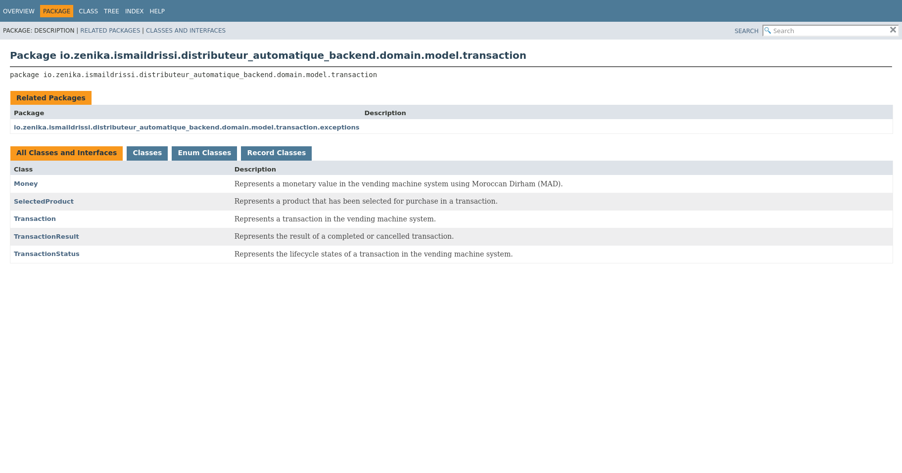
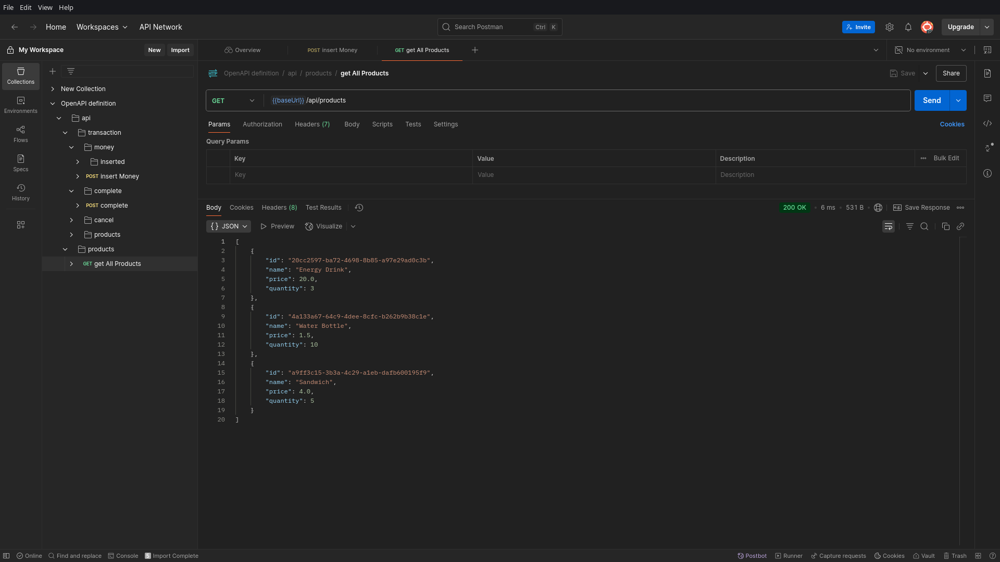
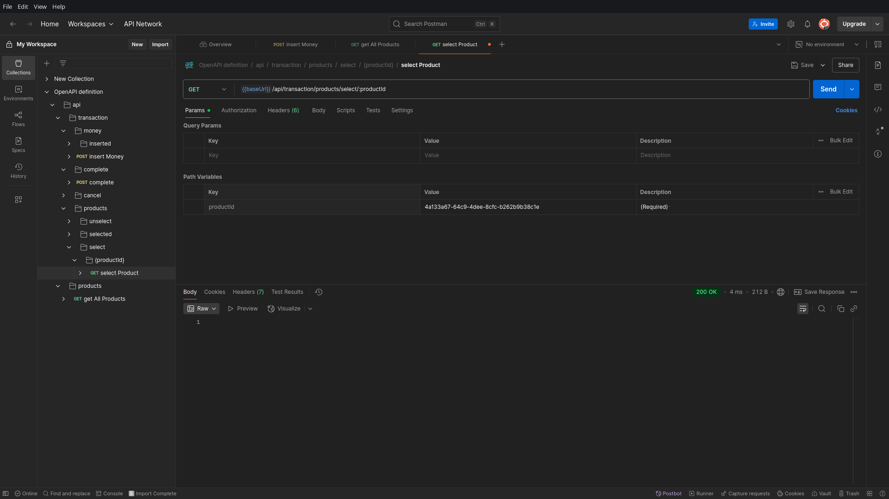

# Vending Machine Backend


A Spring Boot backend application implementing a **vending machine system** based on **Domain-Driven Design (DDD)**. The system manages transaction lifecycles, inventory control, and monetary operations with a clear architectural separation.

## Table of Contents

* [Project Overview](#project-overview)
* [Architecture](#architecture)
* [Project Structure](#project-structure)
* [Testing and Code Quality](#testing-and-code-quality)
* [Documentation](#documentation)
* [Domain Model](#domain-model)
* [Getting Started](#getting-started)
* [API Documentation](#api-documentation)

## Project Overview

This backend system for a **Vending Machine** is developed with **Spring Boot** and adheres to **DDD** principles for high cohesion and low coupling. It handles complex business workflows such as inventory checks, money insertion, transaction processing, and change return.

## Architecture

This project follows a **four-layer DDD architecture**:

### Domain Layer

* Core business logic
* Entities, value objects, and business rules
* Technology-agnostic
* Key responsibilities:

    * Inventory management
    * Transaction state management
    * Denomination validation
    * Change calculation using a greedy algorithm

### Application Layer

* Use case orchestration
* Manages workflows and DTOs
* Maps domain models to external representations
* Handles application-level exceptions

### Infrastructure Layer

* Technical implementations
* JPA persistence using Spring Data
* Maps entities to domain objects

### Presentation Layer

* Exposes RESTful APIs
* Validates and handles HTTP requests/responses
* Provides global exception handling

### Layer Interaction


## Project Structure

```text
src/main/java/io/zenika/ismaildrissi/distributeur_automatique_backend/
├── domain/                # Core business logic
│   ├── model/             # Domain models and value objects
│   ├── repository/        # Repository interfaces
│   └── service/           # Domain services
├── application/           # Use cases, DTOs, services
├── infrastructure/        # JPA repositories, entity mappers
├── controller/            # REST controllers
└── DistributeurAutomatiqueBackendApplication.java
```

## Testing and Code Quality

### Strategy

The project uses **JUnit 5**, **Mockito**, and **JaCoCo**. Coverage thresholds:

* **Instruction Coverage**: 80%
* **Branch Coverage**: 80%

### Metrics

| Metric               | Value |
| -------------------- | ----- |
| Total Test Cases     | 125   |
| Instruction Coverage | 94%   |
| Branch Coverage      | 92%   |


## Documentation

### Javadoc

Generate with:

```bash
mvn javadoc:javadoc
open target/site/apidocs/index.html
```




## Domain Model

### Diagram


### Key Elements

#### Aggregate Roots

* **Product**: Manages inventory and validation
* **VendingMachine**: Central coordinator
* **Transaction**: Manages lifecycle
* **TransactionResult**: Encapsulates transaction output

#### Value Objects

* **ProductId**: Type-safe identifier
* **Money**: Validates MAD denominations
* **SelectedProduct**: Immutable selection snapshot

#### Rules Enforced

* Accept only valid MAD denominations
* Prevent out-of-stock dispensing
* Transaction state transitions must be valid
* Calculate optimal change using greedy algorithm

## Getting Started

```bash
git clone https://github.com/ismaildrs/distributeur-automatique-backend.git
cd distributeur-automatique-backend
mvn clean test
mvn jacoco:report
mvn spring-boot:run
```

Visit: `http://localhost:8080/api/products`

## API Documentation

### Swagger


### Endpoints

#### Product Management

```http
GET /api/products
```

#### Transaction Flow

```http
POST /api/transaction/money
{
  "value": 2.0
}

GET /api/transaction/products/select/{productId}
GET /api/transaction/products/unselect/{productId}
POST /api/transaction/complete
POST /api/transaction/cancel
```

#### Status

```http
GET /api/transaction/money/inserted
GET /api/transaction/products/selected
```

### Postman Screenshots

* Get All Products: 
* Insert Money: 
* Select Product: 
* Complete Transaction: 
* Cancel Transaction: 
