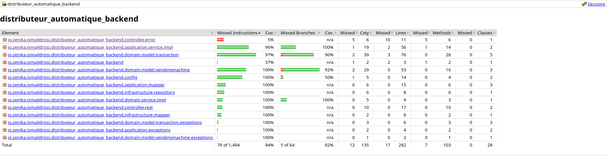

# Vending Machine Backend

[](https://github.com/ismaildrs/distributeur-automatique-backend)
[](https://openjdk.java.net/projects/jdk/17/)
[](https://spring.io/projects/spring-boot)

A comprehensive Spring Boot backend application implementing a **vending machine system** using **Domain-Driven Design (DDD)** architectural principles. This solution manages the complete transaction lifecycle, inventory control, and monetary operations.

## Table of Contents

* [Project Overview](#project-overview)
* [Technology Stack](#technology-stack)
* [Project Structure](#project-structure-explanation)
* [Testing & Code Quality](#testing-and-code-quality)
* [Documentation](#documentation)
* [Domain Model](#uml-class-diagram-of-domain-layer)
* [Getting Started](#getting-started)
* [API Documentation](#api-documentation)

## Project Overview

This is the backend of a **Vending Machine**. It is a Spring Boot application architected using **Domain-Driven Design (DDD)** principles to deliver a robust, maintainable, and scalable solution. The system orchestrates complex business workflows including transaction management, inventory control, monetary validation, and change calculation algorithms.

### Architectural Foundation

The application implements a **four-layer DDD architecture** that ensures clear separation of concerns, testability, and long-term maintainability:

#### **Domain Layer**

The **core business logic layer** containing pure domain models, entities, value objects, and business rules. This layer is technology-agnostic and represents the heart of the vending machine business domain, including:

* Product inventory management and availability validation
* Transaction lifecycle and state management
* Monetary operations with denomination validation
* Change calculation algorithms using greedy optimization

#### **Application Layer**

The **use case orchestration layer** that coordinates domain operations and manages application workflows. This layer encapsulates:

* Application services implementing specific use cases
* Data Transfer Objects (DTOs) for external communication
* Object mapping between domain models and DTOs
* Application-specific exception handling and validation
* Transaction coordination and business process management

#### **Infrastructure Layer**

The **technical implementation layer** providing concrete implementations for external concerns:

* JPA-based persistence with Spring Data repositories
* Database entity mapping and relationship management

#### **Presentation Layer (Controller)**

The **API interface layer** exposing RESTful endpoints for client interactions:

* HTTP request/response handling and validation
* Global exception handling with standardized error responses

### Layer Interaction Principles


## Technology Stack

### Core Framework

* **Spring Boot 3** – Enterprise application framework with auto-configuration and production-ready features
* **Spring Data JPA** – Data access layer with repository pattern implementation and query optimization
* **Spring Web** – RESTful web services with comprehensive HTTP support and content negotiation

### Database & Persistence

* **H2 Database** – In-memory database for development, testing, and demonstration environments
* **JPA/Hibernate** – Object-relational mapping with advanced caching and performance optimization

### Testing & Quality Assurance

* **JUnit 5** – Modern testing framework with advanced assertions, parameterized tests, and nested test organization
* **Mockito** – Comprehensive mocking framework for unit testing with strict verification and stubbing capabilities
* **JaCoCo** – Code coverage analysis and reporting with build integration

**Coverage Thresholds:**

* **Instruction Coverage:** 80%
* **Branch Coverage:** 80%

### Development & Documentation

* **Lombok** – Annotation-based code generation reducing boilerplate for getters, setters, constructors, and builders
* **Javadoc** – Comprehensive API documentation generation with cross-references and business context explanations
* **Maven** – Build automation, dependency management, and project lifecycle management

## Project Structure Explanation

The project follows a **clean architecture approach** with clear layer boundaries and dependency inversion principles:

```
src/main/java/io/zenika/ismaildrissi/distributeur_automatique_backend/
│
├── domain/                                      # Domain Layer (Core Business Logic)
│   ├── model/
│   │   ├── vendingmachine/                      # Product aggregates and value objects
│   │   │   ├── Product.java                     # Product entity with inventory management
│   │   │   ├── ProductId.java                   # Type-safe product identifier
│   │   │   └── VendingMachine.java              # Root aggregate for machine operations
│   │   └── transaction/                         # Transaction aggregates and value objects
│   │       ├── Transaction.java                 # Transaction entity with state management
│   │       ├── Money.java                       # Value object for monetary operations
│   │       ├── SelectedProduct.java             # Value object for product selection
│   │       ├── TransactionResult.java           # Transaction outcome encapsulation
│   │       ├── TransactionStatus.java           # Transaction state enumeration
│   │       └── exceptions/                      # Domain-specific exceptions
│   ├── repository/                              # Repository interfaces (contracts)
│   │   └── VendingMachineRepository.java        # Product persistence contract
│   └── service/                                 # Domain services
│       └── ChangeCalculator.java                # Change calculation algorithms
│
├── application/                                 # Application Layer (Use Cases)
│   ├── dto/                                     # Data Transfer Objects
│   │   ├── ProductDTO.java                      # Product representation for API
│   │   ├── MoneyDTO.java                        # Money representation for API
│   │   ├── SelectedProductDTO.java              # Selected product for transactions
│   │   └── OrderDTO.java                        # Order completion/cancellation result
│   ├── service/                                 # Application services
│   │   ├── ProductService.java                  # Product management use cases
│   │   ├── TransactionService.java              # Transaction management use cases
│   │   └── impl/                                # Service implementations
│   ├── mapper/                                  # Domain ↔ DTO mapping
│   │   ├── ProductMapperDto.java                # Product mapping logic
│   │   ├── MoneyMapper.java                     # Money mapping logic
│   │   └── SelectedProductMapper.java           # Selected product mapping
│   └── exceptions/                              # Application-level exceptions
│       ├── ProductNotFoundException.java        # Product lookup failures
│       └── MoneyNotYetInserted.java             # Transaction state violations
│
├── infrastructure/                              # Infrastructure Layer (Technical Implementation)
│   ├── repository/                              # Persistence implementations
│   │   ├── jpa/                                 # JPA entities and repositories
│   │   │   ├── ProductEntity.java               # JPA product entity
│   │   │   └── SpringDataProductRepository.java # Spring Data repository
│   │   └── impl/                                # Repository implementations
│   │       └── VendingMachineRepositoryImpl.java # Domain repository implementation
│   └── mapper/                                  # Entity ↔ Domain mapping
│       └── ProductMapper.java                   # JPA entity mapping logic
│
├── controller/                                  # Presentation Layer (REST API)
│   └── rest/                                    # REST controllers
│       ├── ProductController.java               # Product API endpoints
│       └── TransactionController.java           # Transaction API endpoints
│
└── DistributeurAutomatiqueBackendApplication.java # Main application class
```

## Testing and Code Quality

### Comprehensive Testing Strategy

The application implements a **multi-layered testing approach** ensuring reliability, maintainability, and business requirement compliance:

#### Test Metrics and Quality Assurance

| Metric                   | Achieved |
| ------------------------ | -------- |
| **Total Test Cases**     | **125**  |
| **Instruction Coverage** | **94%**  |
| **Branch Coverage**      | **92%**  |



## Documentation

### Comprehensive Javadoc Implementation

The entire codebase features **enterprise-grade Javadoc documentation** following industry best practices and clean code principles:

#### Generated Documentation Access

```bash
# Generate comprehensive API documentation
mvn javadoc:javadoc

# Open generated documentation
open target/site/apidocs/index.html
```


## UML Class Diagram of Domain Layer

The following diagram illustrates the core domain model structure, relationships, and key operations:


### Domain Model Analysis

#### Entities (Aggregate Roots)

* **Product**: Manages inventory state and availability with business rule enforcement
* **VendingMachine**: Central aggregate coordinating product management and change operations
* **Transaction**: Orchestrates the complete purchase workflow with state management
* **TransactionResult**: Encapsulates transaction outcomes for application layer consumption

#### Value Objects

* **ProductId**: Type-safe identifier preventing primitive obsession and ensuring referential integrity
* **Money**: Immutable monetary representation with validation for valid MAD denominations (0.5, 1.0, 2.0, 5.0, 10.0)
* **SelectedProduct**: Immutable snapshot preserving product information at selection time

#### Business Rules Enforcement

* **Monetary Validation**: Only valid MAD coin denominations accepted
* **Inventory Constraints**: Products cannot be dispensed when out of stock
* **Transaction Integrity**: State transitions follow defined business rules
* **Change Calculation**: Optimal coin distribution based on available inventory

## Getting Started

```bash
# Clone the repository
git clone https://github.com/ismaildrs/distributeur-automatique-backend.git
cd distributeur-automatique-backend

# Run comprehensive test suite
mvn clean test

# Generate test coverage report
mvn jacoco:report

# Start the application
mvn spring-boot:run

# Access the application
curl http://localhost:8080/api/products
```

## API Documentation

### Swagger Documentation


### Core Endpoints

#### Product Management

```http
GET /api/products
Content-Type: application/json

Response: List of available products with inventory information
```

#### Transaction Operations

```http
# Insert money into transaction
POST /api/transaction/money
Content-Type: application/json
{
  "value": 2.0
}

# Select product for purchase
GET /api/transaction/products/select/{productId}

# Unselect product from transaction
GET /api/transaction/products/unselect/{productId}

# Complete transaction
POST /api/transaction/complete
Response: OrderDTO with dispensed products and change

# Cancel transaction
POST /api/transaction/cancel
Response: OrderDTO with returned money
```

#### Transaction Status

```http
# Get inserted money total
GET /api/transaction/money/inserted

# Get selected products
GET /api/transaction/products/selected
```

### Postman API Testing

The following screenshots demonstrate the API endpoints using Postman:

#### Get All Products


#### Insert Money


#### Select Product


#### Get Selected Products


#### Complete Transaction


#### Cancel Transaction


