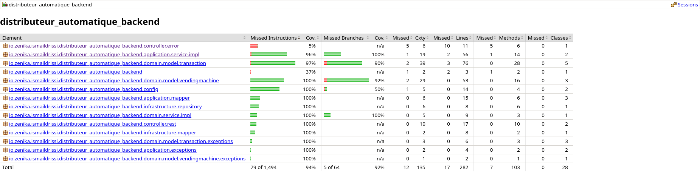
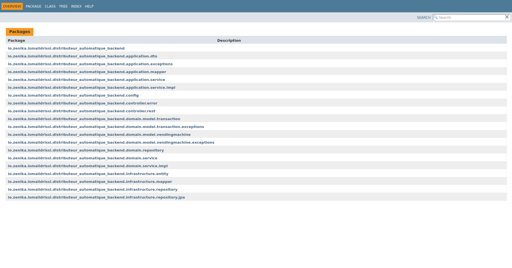
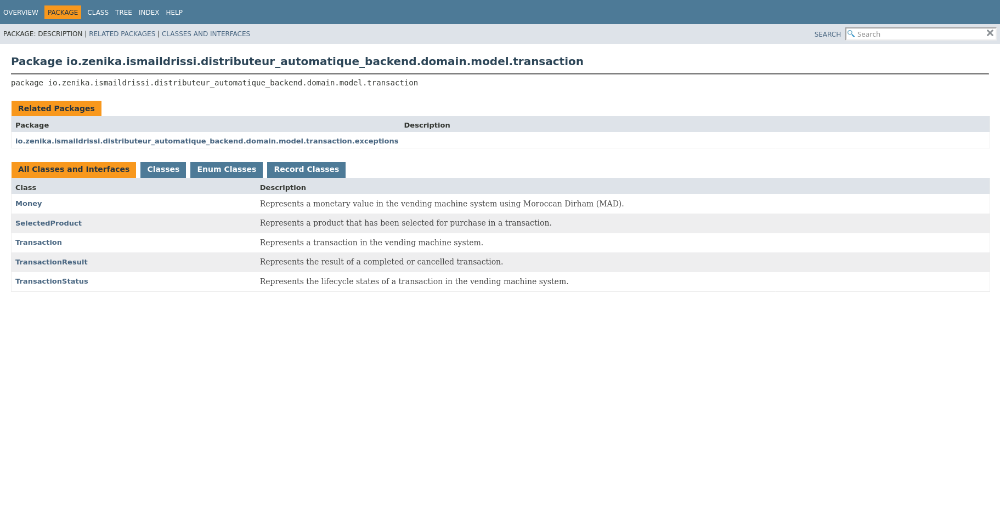
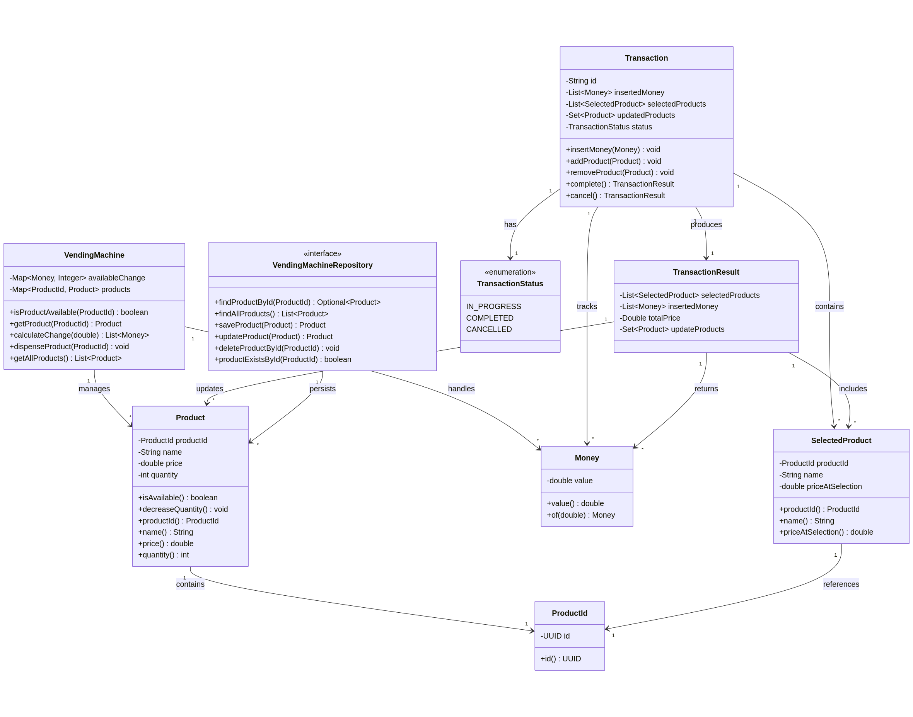
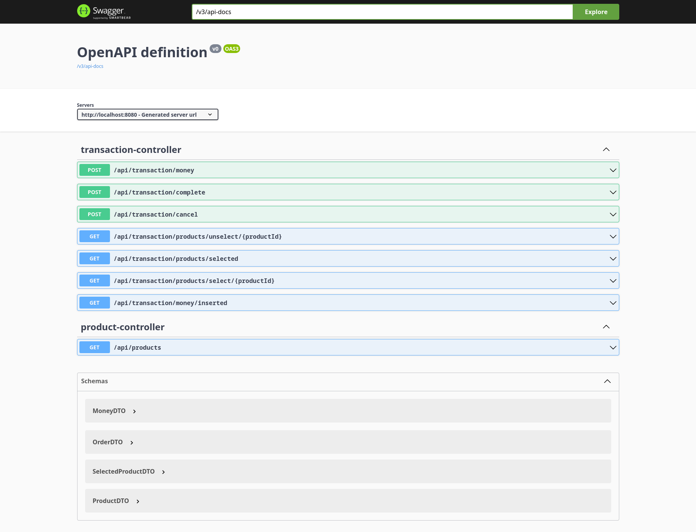
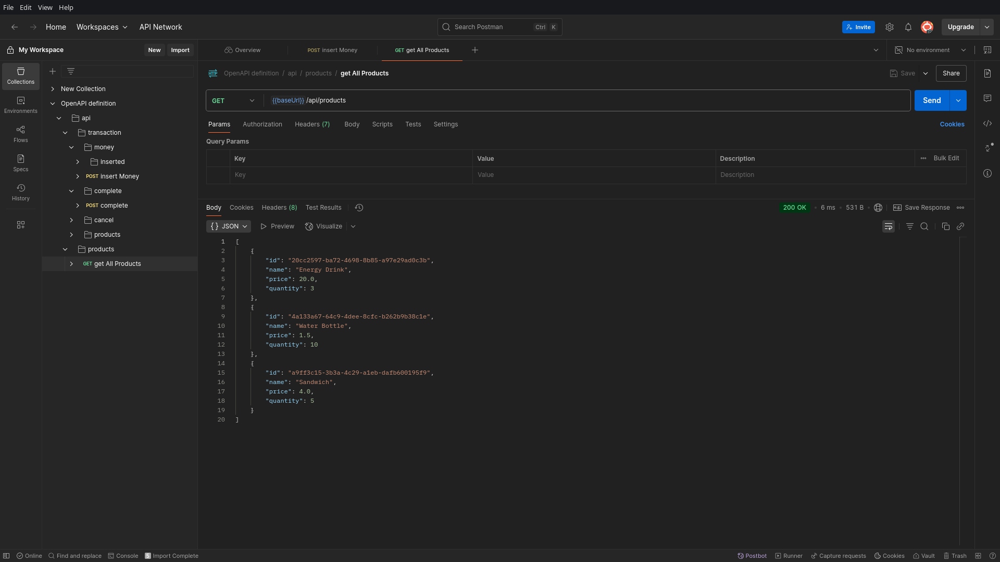
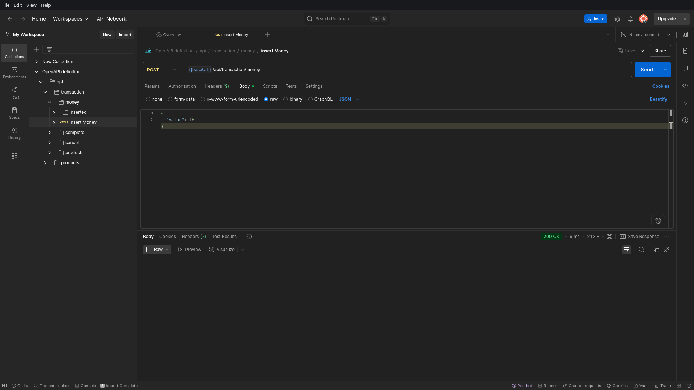
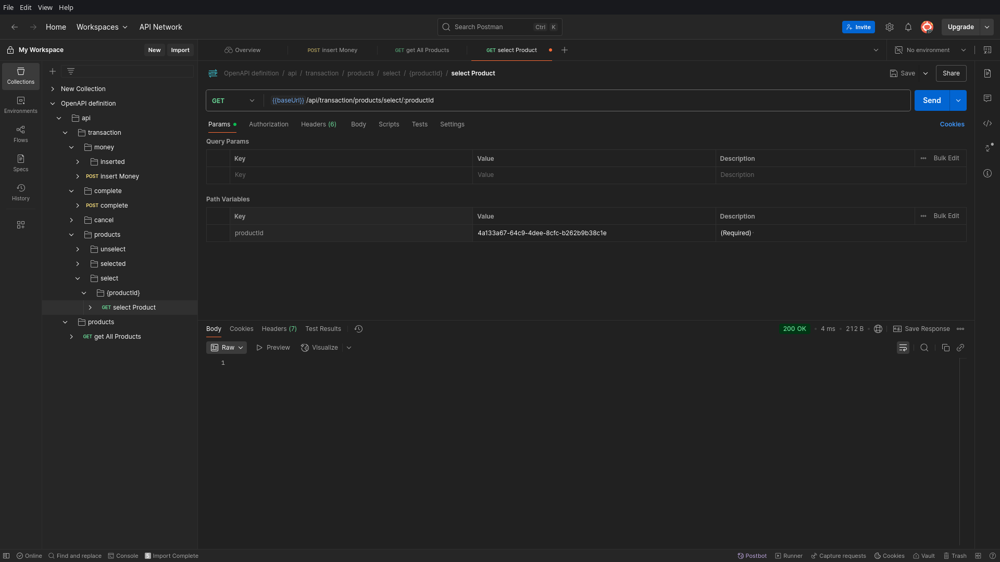
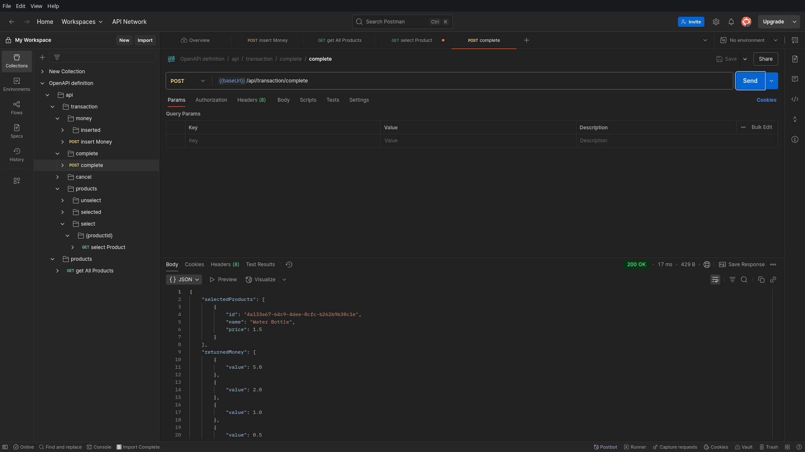
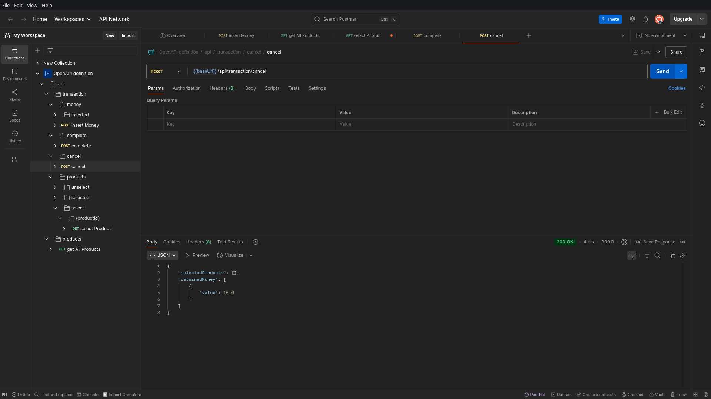

# Backend du Distributeur Automatique

[](https://github.com/ismaildrs/distributeur-automatique-backend)
[](https://openjdk.java.net/projects/jdk/17/)
[](https://spring.io/projects/spring-boot)

Une application backend complète avec **Spring Boot** implémentant un **système de distributeur automatique** selon les principes de l'architecture **Domain-Driven Design (DDD)**. Cette solution gère le cycle de vie complet des transactions, le contrôle de l'inventaire et les opérations monétaires.

## Table des Matières

* [Présentation du Projet](#présentation-du-projet)
* [Stack Technologique](#stack-technologique)
* [Structure du Projet](#structure-du-projet)
* [Tests & Qualité du Code](#tests-et-qualité-du-code)
* [Documentation](#documentation)
* [Modèle de Domaine](#diagramme-de-classes-du-domaine)
* [Démarrage Rapide](#démarrage-rapide)
* [Documentation de l'API](#documentation-de-lapi)

## Présentation du Projet

Ce backend de **distributeur automatique** est basé sur **Spring Boot** et conçu selon les principes **DDD** pour offrir une solution robuste, maintenable et évolutive. Il orchestre des processus métier complexes tels que la gestion des transactions, le contrôle de l'inventaire, la validation monétaire et le calcul de la monnaie rendue.

### Architecture

L'application suit une architecture **DDD en quatre couches** assurant une séparation claire des responsabilités, une testabilité optimale et une grande maintenabilité :

#### **Couche Domaine**

La couche **cœur du métier** contenant les modèles, entités, objets de valeur et règles métier. Elle est indépendante des technologies :

* Gestion de l'inventaire et validation de disponibilité
* Gestion du cycle de vie des transactions
* Validation des dénominations monétaires
* Algorithmes de calcul de la monnaie
* Invariants métier et logique métier pure

#### **Couche Application**

La couche **orchestration des cas d'usage**, coordonnant les opérations métier :

* Services applicatifs pour les cas d'usage
* DTO pour la communication externe
* Mappage entre modèles de domaine et DTO
* Gestion des exceptions spécifiques à l'application
* Coordination des processus métier

#### **Couche Infrastructure**

La couche **technique**, implémentant les dépendances externes :

* Persistance via Spring Data JPA
* Mappage des entités et gestion des relations
* Intégrations de services externes
* Injection de dépendances et configurations
* Journalisation, surveillance

#### **Couche Présentation (Contrôleurs)**

La couche **API REST** pour l'interaction avec les clients :

* Gestion des requêtes HTTP
* Gestion globale des exceptions

### Diagramme d’Interaction des Couches


## Stack Technologique

### Frameworks

* **Spring Boot 3.x** – Framework d'application avec configuration automatique
* **Spring Data JPA** – Accès aux données via le pattern Repository
* **Spring Web** – Création de services REST

### Base de Données & Persistance

* **H2** – Base en mémoire pour développement/test
* **JPA/Hibernate** – ORM avec optimisation

### Tests & Qualité

* **JUnit 5** – Tests unitaires et paramétrés
* **Mockito** – Mocking et vérification
* **JaCoCo** – Couverture de code intégrée au build

**Seuils de Couverture :**

* **Instructions :** 80%
* **Branches :** 80%

### Développement & Documentation

* **Lombok** – Réduction du code boilerplate
* **Javadoc** – Génération de documentation API
* **Maven** – Gestion des dépendances et du cycle de vie

## Structure du Projet

Le projet suit une **architecture propre (clean architecture)** avec inversion de dépendances :

```
src/main/java/io/zenika/ismaildrissi/distributeur_automatique_backend/
│
├── domain/                     # Logique métier
│   ├── model/                  # Modèles métiers
│   │   ├── vendingmachine/    # Produits & machine
│   │   └── transaction/       # Transactions
│   ├── repository/            # Interfaces de dépôt
│   └── service/               # Services métier
│
├── application/               # Cas d’usage
│   ├── dto/                   # Objets de transfert
│   ├── service/               # Services applicatifs
│   ├── mapper/                # Mappage DTO ↔ Domaine
│   └── exceptions/            # Exceptions spécifiques
│
├── infrastructure/            # Implémentations techniques
│   ├── repository/            # JPA et implémentations
│   └── mapper/                # Mappage entité ↔ domaine
│
├── controller/                # API REST
│   └── rest/                  # Contrôleurs REST
│
└── DistributeurAutomatiqueBackendApplication.java
```

## Tests et Qualité du Code

### Stratégie Complète de Tests

L'application applique une **stratégie multi-niveaux** pour la fiabilité et conformité métier :

#### Statistiques de Test

| Métrique                    | Valeur  |
| --------------------------- | ------- |
| **Nombre de Tests**         | **125** |
| **Couverture Instructions** | **94%** |
| **Couverture Branches**     | **92%** |



## Documentation

### Documentation Javadoc

Toute la base de code est documentée selon les standards industriels :

#### Génération de la Documentation

```bash
mvn javadoc:javadoc
open target/site/apidocs/index.html
```




## Diagramme de Classes du Domaine

Le diagramme suivant illustre la structure principale des modèles métier :



### Analyse du Modèle

#### Entités

* **Product** : Gère le stock et les règles de disponibilité
* **VendingMachine** : Agrégat central
* **Transaction** : Orchestration du processus d’achat
* **TransactionResult** : Résultat de transaction

#### Objets de Valeur

* **ProductId** : Identifiant typé
* **Money** : Représentation monétaire immuable
* **SelectedProduct** : Snapshot produit sélectionné

#### Règles Métiers

* **Validation Monétaire** : Seulement pièces valides (0.5, 1.0, 2.0, 5.0, 10.0 MAD)
* **Contraintes d’Inventaire** : Pas de distribution hors stock
* **Transitions de Transaction** : Respect des états autorisés
* **Calcul de la Monnaie** : Algorithme optimal basé sur l’inventaire

## Démarrage Rapide

```bash
git clone https://github.com/ismaildrs/distributeur-automatique-backend.git
cd distributeur-automatique-backend

mvn clean test
mvn jacoco:report
mvn spring-boot:run

curl http://localhost:8080/api/products
```

## Documentation de l’API

### Swagger



### Points de Terminaison Clés

#### Gestion des Produits

```http
GET /api/products
```

#### Opérations de Transaction

```http
POST /api/transaction/money
{
  "value": 2.0
}

GET /api/transaction/products/select/{productId}
GET /api/transaction/products/unselect/{productId}
POST /api/transaction/complete
POST /api/transaction/cancel
```

#### État de la Transaction

```http
GET /api/transaction/money/inserted
GET /api/transaction/products/selected
```

### Tests API avec Postman

#### Produits



#### Ajouter de l’Argent



#### Sélectionner Produit



#### Produits Sélectionnés


#### Terminer Transaction



#### Annuler Transaction


