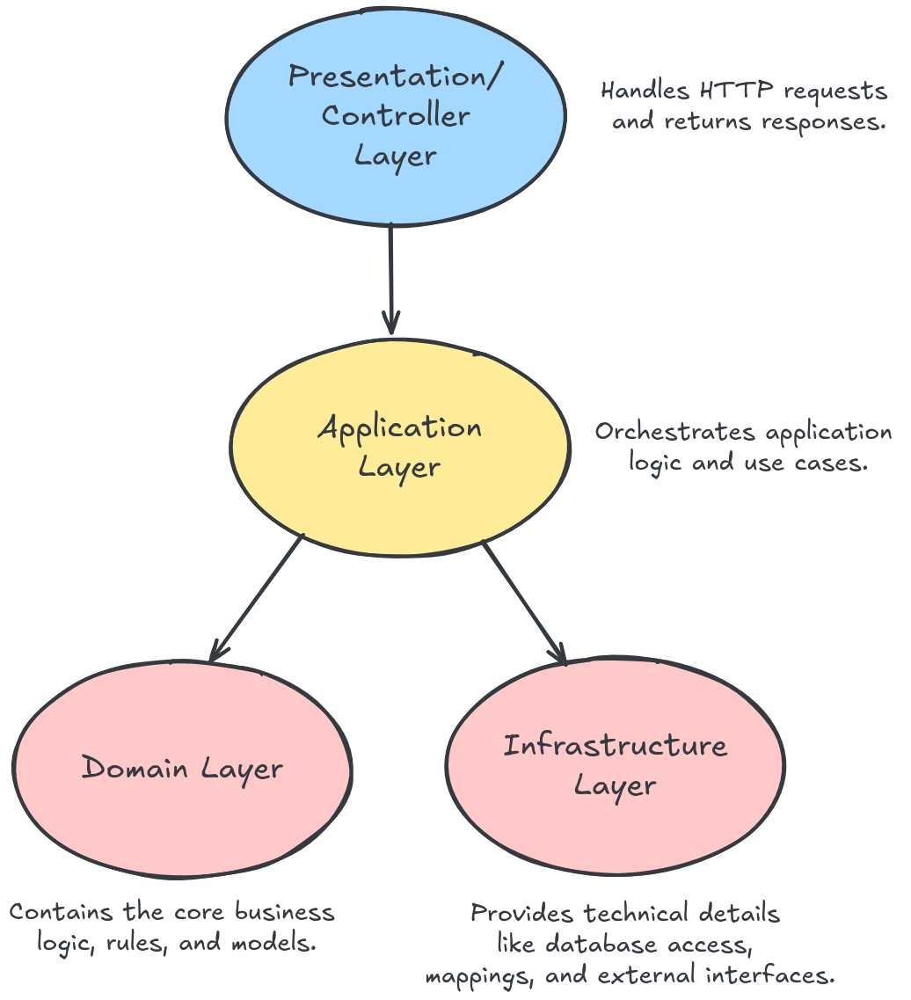

# Distributeur Automatique - Backend


Application backend Spring Boot implémentant un **système de distributeur automatique** basé sur le **Domain-Driven Design (DDD)**. Le système gère le cycle de vie des transactions, le contrôle des stocks et les opérations monétaires avec une séparation architecturale claire.

## Table des matières

* [Présentation du projet](#présentation-du-projet)
* [Intuition](#intuition)
* [Architecture](#architecture)
* [Structure du projet](#structure-du-projet)
* [Tests et qualité du code](#tests-et-qualité-du-code)
* [Documentation](#documentation)
* [Modèle de domaine](#modèle-de-domaine)
* [Démarrage](#démarrage)
* [Documentation API](#documentation-api)

## Présentation du projet

Ce backend pour un **distributeur automatique** est développé avec **Spring Boot** et respecte les principes du **DDD** pour assurer une forte cohésion et un faible couplage. Il prend en charge des workflows métier complexes tels que la gestion des stocks, l'insertion d'argent, le traitement des transactions et le rendu de la monnaie.

## Intuition

Voici la démarche qui a guidé la conception de ce projet.

J’ai commencé par définir des principes de conception en me basant sur le fonctionnement classique d’un distributeur automatique et les scénarios fournis. En général, le processus est simple :

1. Insérer de l’argent
2. Acheter un article
3. Recevoir la monnaie
4. Répéter pour un autre article

Cependant, le second scénario présenté a remis en question ce modèle. L’utilisateur insère de l’argent, choisit **deux produits**, puis finalise la transaction — moment où les produits sont délivrés. Cela nécessite un modèle transactionnel basé sur des **déclencheurs (triggers)** plutôt qu’un processus linéaire.

J’ai donc fait un parallèle avec les **transactions en base de données**. Comme en base, où l’on peut démarrer une transaction (implicite ou explicite), exécuter des opérations, puis soit **valider (commit)** soit **annuler (rollback)**, on peut appliquer ce même concept ici.

* **Démarrage de la transaction :** implicite, déclenché par l’insertion d’une pièce après la fin de la transaction précédente
* **Opérations :** sélection des produits en fonction des fonds disponibles
* **Fin de transaction :** déclenchée explicitement par validation ou annulation de l’achat

Dans ce modèle, la **transaction** est séparée conceptuellement de la **machine** elle-même. La machine maintient son état (stocks, pièces), tandis que la transaction garde la trace des changements temporaires — argent inséré, produits sélectionnés — sans modifier immédiatement la machine.

Une décision clé a été de **lier la sélection des produits aux fonds disponibles** : un produit ne peut être sélectionné que si suffisamment d’argent a été inséré. Cela garantit que la transaction reste toujours dans un état valide, ce qui facilite la validation et évite les incohérences.

Le **second déclencheur** — qui finalise ou annule la transaction — est explicite, comme un bouton “confirmer” ou “annuler” sur la machine. Si la transaction est annulée, aucun changement n’est appliqué à l’état de la machine : l’argent est restitué et les produits sélectionnés sont ignorés. Si elle est validée, les produits sont délivrés et l’état de la machine mis à jour.

Cette séparation est efficace car un distributeur sert **un client à la fois**. On peut donc voir la machine et la transaction active comme des **singletons conceptuels** — même si ce ne sont pas des instances singleton au sens technique.


Pour calculer la monnaie à rendre après un achat, j’ai utilisé un **algorithme glouton (greedy algorithm)**. Cette approche est à la fois pratique et optimale dans la majorité des cas réels. Le but est de rendre la monnaie avec le **nombre minimal de pièces possible**, en privilégiant les **plus grosses coupures**. Cela présente deux avantages majeurs :

* Plus rapide et plus pratique pour l’utilisateur qui reçoit moins de pièces
* Permet à la machine de préserver les petites coupures, souvent nécessaires pour rendre la monnaie avec précision lors des transactions futures


## Architecture

Ce projet suit une **architecture DDD en quatre couches** :

### Couche Domaine

* Logique métier centrale
* Entités, objets valeur, règles métier
* Indépendante des technologies
* Responsabilités clés :

    * Gestion des stocks
    * Gestion de l’état des transactions
    * Validation des coupures monétaires
    * Calcul de la monnaie via algorithme glouton

### Couche Application

* Orchestration des cas d’usage
* Gestion des workflows et des DTO
* Mapping entre modèles domaine et représentations externes
* Gestion des exceptions applicatives

### Couche Infrastructure

* Implémentations techniques
* Persistance JPA avec Spring Data
* Mapping entités ↔ objets domaine

### Couche Présentation

* Exposition des API REST
* Validation et gestion des requêtes/réponses HTTP
* Gestion globale des exceptions

### Interaction des couches



## Structure du projet

```text
src/main/java/io/zenika/ismaildrissi/distributeur_automatique_backend/
├── domain/                # Logique métier
│   ├── model/             # Modèles et objets valeur du domaine
│   ├── repository/        # Interfaces des repositories
│   └── service/           # Services métier
├── application/           # Cas d’usage, DTOs, services
├── infrastructure/        # Repositories JPA, mappers entités
├── controller/            # Contrôleurs REST
└── DistributeurAutomatiqueBackendApplication.java
```

## Tests et qualité du code

### Stratégie

Le projet utilise **JUnit 5**, **Mockito** et **JaCoCo**. Seuils de couverture :

* **Couverture instruction** : 80%
* **Couverture branche** : 80%

### Résultats

| Indicateur             | Valeur |
| ---------------------- | ------ |
| Nombre total de tests  | 125    |
| Couverture instruction | 94%    |
| Couverture branche     | 92%    |


## Documentation

### Javadoc

Génération avec :

```bash
mvn javadoc:javadoc
open target/site/apidocs/index.html
```


## Modèle de domaine

### Diagramme


### Éléments clés

#### Racines d’agrégat

* **Product (Produit)** : gestion des stocks et validation
* **VendingMachine (Distributeur)** : coordinateur central
* **Transaction** : gestion du cycle de vie
* **TransactionResult** : encapsulation du résultat de transaction

#### Objets valeur

* **ProductId** : identifiant typé
* **Money (Argent)** : validation des coupures MAD
* **SelectedProduct** : snapshot immuable de la sélection

#### Règles appliquées

* Acceptation uniquement des coupures MAD valides
* Empêche la délivrance hors stock
* Transitions d’état de transaction valides uniquement
* Calcul optimal de la monnaie via algorithme glouton

## Démarrage

```bash
git clone https://github.com/ismaildrs/distributeur-automatique-backend.git
cd distributeur-automatique-backend
mvn clean test
mvn jacoco:report
mvn spring-boot:run
```

**Puis accéder à la documentation Swagger via : `http://localhost:8080/swagger-ui/index.html#/`**

## Documentation API

### Swagger


### Endpoints

#### Gestion des produits

```http
GET /api/products
```

#### Gestion des transactions

```http
POST /api/transaction/money
{
  "value": 2.0
}

GET /api/transaction/products/select/{productId}
GET /api/transaction/products/unselect/{productId}
POST /api/transaction/complete
POST /api/transaction/cancel
```

#### Statut

```http
GET /api/transaction/money/inserted
GET /api/transaction/products/selected
```

### Captures Postman

* Obtenir tous les produits : 
* Insérer de l’argent : 
* Sélectionner un produit : 
* Finaliser la transaction : 
* Annuler la transaction : 
